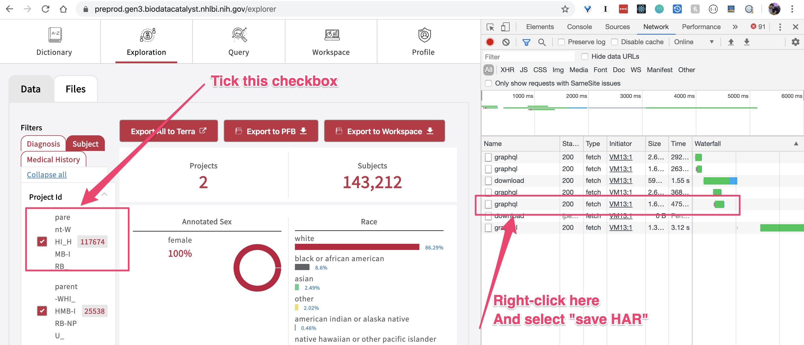

# How to run k6 load tests with HAR (HTTP Archive)

## 3 simple steps

### Generate new Guppy queries by instrumenting the faceted search in the Exploration page: 

e.g., just enable your browser's "inspect" panel and click on one of the checkboxes to filter subjects for your cohort.



----
### Once the HAR file is downloaded, just convert it to a load test script:

```
% k6 convert -O loadtest.js preprod.gen3.biodatacatalyst.nhlbi.nih.gov.har
```

## And, finally, run the load test

Adjust the number of virtual users (VUs) accordingly (_if you face any "too many open files" error, try to decrease the number of VUs_).

```
% k6 run --vus 120 --duration 300s loadtest.js
```

This is it. If you have any questions, contact the QA team.
